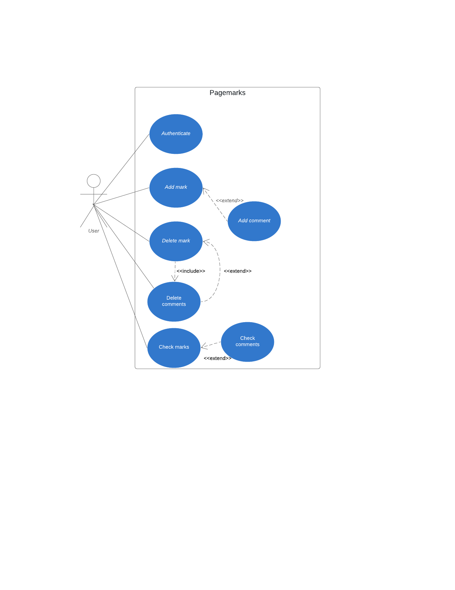
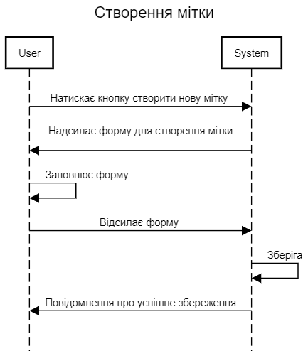
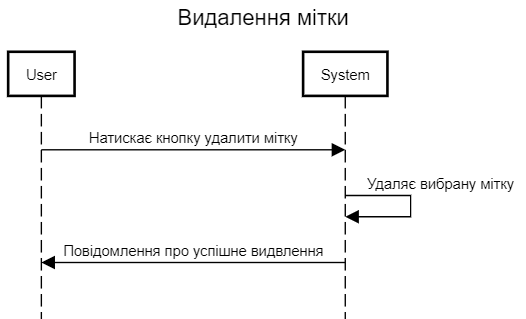
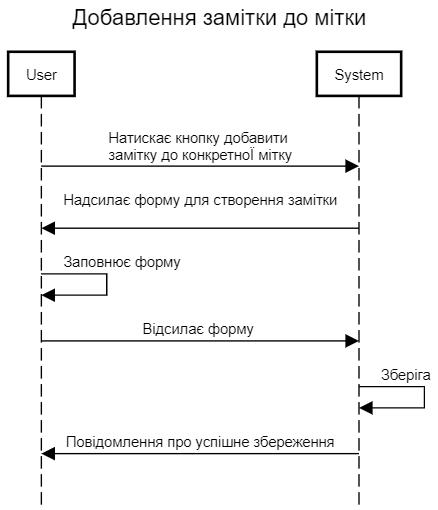
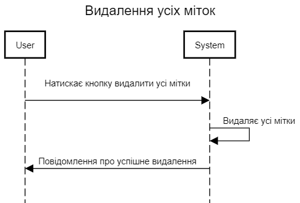

# Pages marks

#### 1. Мета
#### 2. Конкретний огляд продукту
#### 3. Usecase diagrams
#### 4. Sequence diagrams

---
 #### 1) Мета :
 > Метою документу є визначення основних вимог до функціональності, продуктивності, доступності, зручності, а також: визначення бізнес-правил та технологічних обмежень, що накладаються на розширення “Page marks”.

#### 2) Конкретний огляд продукту
> Розширення дає можливість створення міток на веб-сторінці для швидкого повернення до них. Також можна видаляти мітки та додавати опис до створеноЇ мітки. 

#### 3) Usecase diagrams

#### 4) Sequence diagrams

